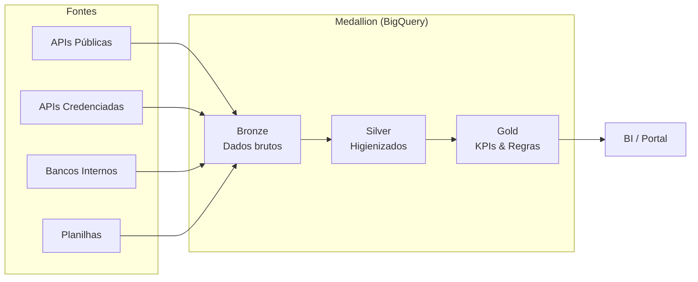

# AlupData — Fase 1: DataLake

**Desenvolvido por <span style="font-family: 'Montserrat', sans-serif; font-weight: 500;">ness<span style="color: #00ade8;">.</span></span>**

> Repositório centralizado de dados operacionais e de mercado do Grupo Alupar.
> Arquitetura Medallion (Bronze → Silver → Gold) na Google Cloud Platform.

## Visão Geral

| Item | Detalhe |
|------|--------|
| **Contrato** | CPS-01025/2026 |
| **Contratantes** | FGE, IJUI, FOZ, QUELUZ, LAVRINHAS, VERDE 08 (Grupo Alupar) |
| **Contratada** | ness. Processos e Tecnologia |
| **Horas** | 580h em 5 ondas (19 semanas) |
| **Kickoff** | 27/08/2026 |
| **Término previsto** | 08/01/2027 |
| **Stack** | Python · BigQuery · Cloud Storage · Terraform · Cloud Composer |

## Cronograma

| Onda | Nome | Início | Término | Horas |
|------|------|--------|---------|-------|
| 0 | Fundação & Arquitetura | 31/08/2026 | 11/09/2026 | 90h |
| 1 | Inteligência de Mercado Base | 14/09/2026 | 16/10/2026 | 120h |
| 2 | Modelos Preditivos & APIs com Credenciais | 19/10/2026 | 13/11/2026 | 110h |
| 3 | Sistemas Internos | 16/11/2026 | 18/12/2026 | 155h |
| 4 | Planilhas, Governança & Handoff | 21/12/2026 | 08/01/2027 | 105h |

Jornada em período comercial (seg–sex). Datas de término = data-alvo de homologação
e de marco de faturamento. Detalhes e feriados:
[Resumo do Contrato](docs/contrato/resumo-contrato.md#cronograma--ondas-de-desenvolvimento-cláusula-4ª).

## Trabalhando neste repositório com um agente

O contexto completo — regras que não se negociam, como escrever um conector,
comandos, convenções e o estado atual — está em **[`AGENTS.md`](AGENTS.md)**.
Leia aquele arquivo antes de mudar qualquer coisa; ele vale para Claude Code,
Codex, Cursor, Gemini, Cline e Copilot.

Atalho: uma fonte nova começa com `make novo-conector fonte=X entidade=Y` e
termina com os 7 componentes da cláusula 2ª. O framework em `src/core/` já faz
raw no GCS, validação, colunas técnicas, carga no Bronze e log de execução — o
conector implementa só `extrair()` e `transformar()`.

## Arquitetura



## Estrutura do Repositório

```
alupdatalake/
├── src/ # Código Python (conectores + core)
├── sql/ # DDL Bronze, Views Silver/Gold
├── dags/ # DAGs Cloud Composer/Airflow
├── infra/ # Terraform (IaC GCP)
├── tests/ # Testes pytest
├── docs/ # Documentação do projeto
└── .github/ # Templates, workflows CI/CD
```

## Quick Start

```bash
# Clone
git clone https://github.com/nessenergy/alupdatalake.git
cd alupdatalake

# Setup Python
uv sync
pre-commit install

# Testes
make test

# Lint
make lint

# Terraform
cd infra && terraform init -backend=false

# Ingestão (o mesmo comando roda local, no Cloud Run Job e na DAG)
uv run alupdata listar
uv run alupdata ingerir ons_carga --de 2026-01-01 --ate 2026-01-31 --dry-run
```

### Comandos do dia a dia

| Comando | O quê |
|---|---|
| `make all` | lint + testes + Bandit + pip-audit — antes de todo PR |
| `make novo-conector fonte=X entidade=Y` | esqueleto dos 7 componentes |
| `make deploy-views` | aplica o SQL de `sql/` no BigQuery |
| `make sync-skills` | atualiza as skills vendorizadas do Google |

## Conectores

| Fonte | Onda | Entrega até | Tipo | Status |
|-------|------|-------------|------|--------|
| Câmbio BCB (PTAX) | 1 | 16/10/2026 | API pública | **Concluído** |
| IBGE (IPCA) | 1 | 16/10/2026 | API pública | **Concluído** |
| ANEEL (SIGA) | 1 | 16/10/2026 | API pública | **Concluído** — fonte de `codigo_usina` |
| ONS (carga diária) | 1 | 16/10/2026 | Arquivo público | **Concluído** — fonte de `submercado` |
| CCEE (InfoMercado) | 1 | 16/10/2026 | API Pública | **Bloqueado** — portal responde 403 a acesso automatizado ([§3.1](docs/plano-execucao.md)) |
| CCEE (Credenciado) | 2 | 13/11/2026 | API Credenciada | Backlog |
| BBCE | 2 | 13/11/2026 | API Credenciada | Backlog |
| Hubspot | 2 | 13/11/2026 | API Credenciada | Backlog |
| TempoOK | 2 | 13/11/2026 | API Credenciada | Backlog |
| Oracle FMB | 3 | 18/12/2026 | Banco Interno | Backlog |
| Portal Alup | 3 | 18/12/2026 | Banco Interno | Backlog |
| MySQL RDS | 3 | 18/12/2026 | Banco Interno | Backlog |
| RM/TOTVS | 3 | 18/12/2026 | Sistema Interno | Backlog |

## Progresso por Onda

Acompanhe no [GitHub Projects](https://github.com/nessenergy/alupdatalake/projects).

## Segurança

| Ferramenta | Função | Cláusula |
|-----------|--------|----------|
| Bandit | SAST — Análise estática de segurança | 8.4 |
| pip-audit | SCA — Vulnerabilidades em dependências | 8.4 |
| Gitleaks | Detecção de secrets no código | 8.5 |
| Secret Manager | Gestão segura de credenciais GCP | 8.5 |

Detalhes: [docs/arquitetura/seguranca.md](docs/arquitetura/seguranca.md)

## Documentação

- [Resumo do Contrato](docs/contrato/resumo-contrato.md)
- [Arquitetura](docs/arquitetura/visao-geral.md)
- [Segurança](docs/arquitetura/seguranca.md)
- [Decisões (ADRs)](docs/arquitetura/decisoes/)
- [Dicionário de Dados](docs/dicionario-dados/)
- [Runbook](docs/runbook/)
- [Onboarding](docs/onboarding.md)
- [Como contribuir](CONTRIBUTING.md)
- [Glossário](docs/glossario.md)
- [Estado do projeto e pendências](docs/status.md)
- [Plano de execução](docs/plano-execucao.md)
- [Runbook de deploy](docs/runbook/deploy.md)
- [Contexto para agentes](AGENTS.md)

## Licença

Propriétario — Desenvolvido sob contrato CPS-01025/2026 para o Grupo Alupar.

