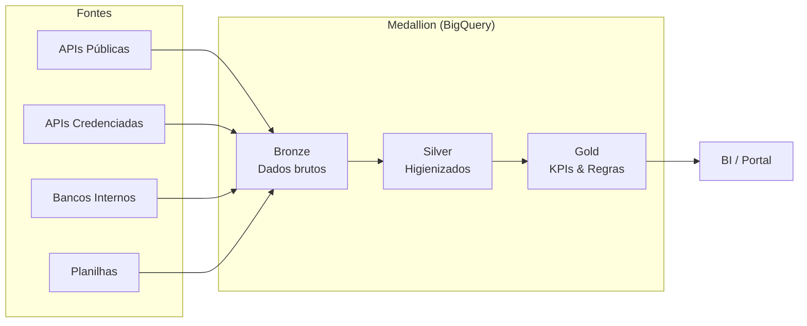

# ️ AlupData — Fase 1: DataLake

> Repositório centralizado de dados operacionais e de mercado do Grupo Alupar.
> Arquitetura Medallion (Bronze → Silver → Gold) na Google Cloud Platform.

## Visão Geral

| Item | Detalhe |
|------|--------|
| **Contrato** | CPS-01025/2026 |
| **Contratantes** | FGE, IJUI, FOZ, QUELUZ, LAVRINHAS, VERDE 08 (Grupo Alupar) |
| **Contratada** | ness. Processos e Tecnologia |
| **Horas** | 580h em 5 ondas (19 semanas) |
| **Stack** | Python · BigQuery · Cloud Storage · Terraform · Cloud Composer |

## Arquitetura



## Estrutura do Repositório

```
alupdatalake/
├── src/ # Código Python (conectores + core)
├── sql/ # DDL Bronze, Views Silver/Gold
├── dags/ # DAGs Cloud Composer/Airflow
├── infra/ # Terraform (IaC GCP)
├── tests/ # Testes pytest
├── docs/ # Documentação do projeto
└── .github/ # Templates, workflows CI/CD
```

## Quick Start

```bash
# Clone
git clone https://github.com/nessenergy/alupdatalake.git
cd alupdatalake

# Setup Python
uv sync
pre-commit install

# Testes
make test

# Lint
make lint

# Terraform
cd infra && terraform init -backend=false
```

## Conectores

| Fonte | Onda | Tipo | Status |
|-------|------|------|--------|
| CCEE (InfoMercado) | 1 | API Pública | Backlog |
| ONS | 1 | API Pública | Backlog |
| ANEEL | 1 | API Pública | Backlog |
| IBGE | 1 | API Pública | Backlog |
| Câmbio BCB | 1 | API Pública | Backlog |
| CCEE (Credenciado) | 2 | API Credenciada | Backlog |
| BBCE | 2 | API Credenciada | Backlog |
| Hubspot | 2 | API Credenciada | Backlog |
| TempoOK | 2 | API Credenciada | Backlog |
| Oracle FMB | 3 | Banco Interno | Backlog |
| Portal Alup | 3 | Banco Interno | Backlog |
| MySQL RDS | 3 | Banco Interno | Backlog |
| RM/TOTVS | 3 | Sistema Interno | Backlog |

## Progresso por Onda

Acompanhe no [GitHub Projects](https://github.com/nessenergy/alupdatalake/projects).

## Segurança

| Ferramenta | Função | Cláusula |
|-----------|--------|----------|
| Bandit | SAST — Análise estática de segurança | 8.4 |
| pip-audit | SCA — Vulnerabilidades em dependências | 8.4 |
| Gitleaks | Detecção de secrets no código | 8.5 |
| Secret Manager | Gestão segura de credenciais GCP | 8.5 |

Detalhes: [docs/arquitetura/seguranca.md](docs/arquitetura/seguranca.md)

## Documentação

- [Resumo do Contrato](docs/contrato/resumo-contrato.md)
- [Arquitetura](docs/arquitetura/visao-geral.md)
- [Segurança](docs/arquitetura/seguranca.md)
- [Decisões (ADRs)](docs/arquitetura/decisoes/)
- [Dicionário de Dados](docs/dicionario-dados/)
- [Runbook](docs/runbook/)
- [Onboarding](docs/onboarding.md)

## Licença

Propriétario — Desenvolvido sob contrato CPS-01025/2026 para o Grupo Alupar.
