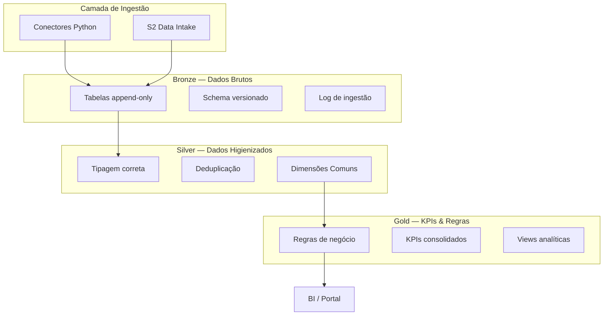

# Arquitetura — AlupData DataLake

## Visão Geral

O AlupData DataLake é um repositório centralizado de dados operacionais e de mercado do Grupo Alupar, estruturado na arquitetura **Medallion** (Bronze → Silver → Gold) sobre a **Google Cloud Platform (GCP)**.

## Arquitetura Medallion

## Dimensões Comuns Silver

**Fechadas contra fontes reais em 2026-09-14** (item 0.11 do plano), com as
regras de negócio que a Alup respondeu no bloco D do
[Questionário de Gaps](../questionario-gaps.md).

Toda view Silver declara as cinco colunas, mesmo quando não as preenche —
`CAST(NULL AS STRING)` explícito. Coluna ausente quebraria consulta que cruza
fontes; coluna nula diz "esta fonte não responde por essa dimensão".

| Dimensão | Fonte da verdade | Regra | Situação |
|---|---|---|---|
| `data_referencia` | cada fonte | Data do fato, não da ingestão. Fonte sem data própria usa a data que a origem declara para o retrato (`aneel_siga`, `ccee_perfil`) | **fechada** |
| `submercado` | `ons_carga` | Sigla `N`, `NE`, `S`, `SE`. A CCEE publica por extenso e o conector converte, para as duas fontes cruzarem sem tradução na Silver | **fechada** |
| `agente_ccee` | `ccee_perfil` | Sigla do agente. Agente e perfil são distintos: um agente tem vários perfis, e é o **perfil** que transaciona | **fechada** desde 14/09 |
| `codigo_usina` | `aneel_siga` (CodCEG) | — | **em aberto — ver §Lacuna 1** |
| `periodo_apuracao` | derivada | `AAAA-MM` do calendário civil | **parcial — ver §Lacuna 2** |

### Regras de negócio que valem na Gold

Respondidas em 11/09 e aplicadas conforme a [ADR 012](decisoes/012-dataform.md):

| # | Regra | Origem |
|---|---|---|
| D3 | Ativo **não muda de coligada**; não há histórico de titularidade a manter | bloco D |
| D5 | Recontabilização da CCEE se **versiona**, não se sobrescreve | bloco D · [ADR 016](decisoes/016-versionamento-de-recontabilizacao.md) |
| D6 | Energia em **MWh e MWmed**; valores em **R$**, milhares ou milhões. **Sem conversão para US$** — a resposta não a cita | bloco D |
| D7 | Valor financeiro em **R$/MWh com duas casas decimais** | bloco D |
| A7 | Granularidade: **usina** para dado de portfólio; usina, estado ou submercado para dado do SIN | bloco A |

### Lacuna 1 — `codigo_usina` não tem de-para

O item **D1** informa que a Alup identifica ativos por **sigla interna** (FGE,
FOZ, IJU, QLZ, LVR, VD8, EAP I e II, PTB, EDV I a IV e X, ALP, ALUP) e que **o
CEG não é usado hoje**. CCEE e ONS usam nomes próprios para os mesmos conjuntos.

Hoje `codigo_usina` é preenchido só pelo `aneel_siga`, com CodCEG. Sem uma
tabela de correspondência **sigla ↔ CEG ↔ nome CCEE ↔ nome ONS**, o portfólio
não cruza com posição comercial nem com contabilização.

**Depende da Alup**: fornecer o de-para, ou a lista de siglas com o CEG
correspondente.

### Lacuna 2 — `periodo_apuracao` só cobre o calendário civil

O item **D4** diz que valem **os dois calendários**: mês civil e mês CCEE. Hoje
toda Silver deriva `periodo_apuracao` com `FORMAT_DATE('%Y-%m', data_referencia)`,
que é só o civil.

Os dois não coincidem no fechamento da contabilização. Enquanto a diferença não
for modelada, agregação mensal que cruze dado da CCEE com dado interno **soma
períodos diferentes sem avisar** — o tipo de erro que não falha, só mente.

**Depende da ness.**: definir a regra do mês CCEE e acrescentar
`periodo_apuracao_ccee` às views que o exigem. Não bloqueia nada hoje, porque
não há dado interno carregado; **bloqueia Risco e Compliance** quando houver.

## 8 Domínios Analíticos

Os domínios da **resposta da Alup ao item B1**, em 11/09. Detalhe por domínio —
pergunta, fontes, granularidade e Gold — em
**[`dominios-analiticos.md`](dominios-analiticos.md)** (item 0.10 do plano).

| # | Domínio | Data owner | Situação |
|---|---|---|---|
| 1 | Mercado de Energia | Taina Mota · Gabriel Barreto (BBCE e prêmio) | pronto no núcleo |
| 2 | Geração e Operacional | Taina Mota · Letícia Ferreira | parcial — Lacuna 1 |
| 3 | Meteorologia | Taina Mota | pronto como arquivo |
| 4 | Comercial e Contratos | Letícia Ferreira · Tahigo Santos | bloqueado (A7) |
| 5 | CRM e Marketing | Tahigo Santos | parcial — token do Hubspot |
| 6 | Risco e Compliance | Letícia Ferreira | não iniciado |
| 7 | Econômico | Letícia Ferreira | parcial — faltam Selic e CDI |
| 8 | Planejamento | gestores da Comercialização | não iniciado |

> **Por que o quadro do B1 tem 11 linhas**: três domínios — Mercado de Energia,
> Geração e Operacional, Comercial e Contratos — aparecem em duas linhas cada,
> porque responsáveis distintos tratam subtemas deles. São 8 domínios, não 11.
>
> **O item A1 não define domínio.** Ele perguntou o que o lake precisa responder
> **como um todo**, e a Alup respondeu com objetivos do programa ("base única",
> "escalar o negócio"). É outra pergunta, e a resposta dela ordena a entrega
> (via A2), não o vocabulário da Gold.

## Stack Tecnológico

| Componente | Tecnologia |
|-----------|------------|
| Linguagem | Python 3.12+ |
| Package Manager | uv |
| Data Warehouse | BigQuery |
| Storage | Cloud Storage |
| Orquestração | Cloud Workflows (ADR 017) |
| Agendamento | Cloud Scheduler |
| Secrets | Secret Manager |
| IaC | Terraform >= 1.5 |
| CI/CD | GitHub Actions |
| Linter | Ruff |
| Testes | pytest |
| SAST | Bandit |
| SCA | pip-audit |
