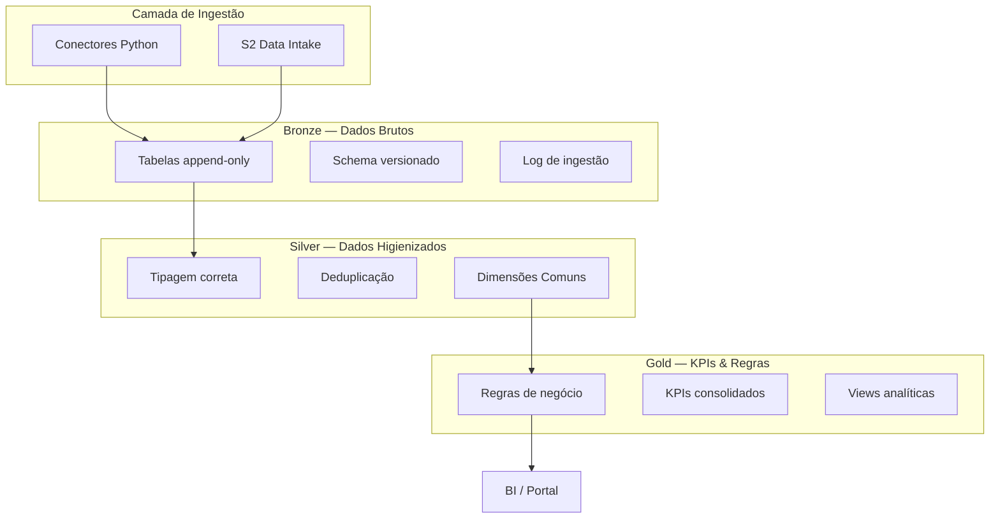

# Arquitetura — AlupData DataLake

## Visão Geral

O AlupData DataLake é um repositório centralizado de dados operacionais e de mercado do Grupo Alupar, estruturado na arquitetura **Medallion** (Bronze → Silver → Gold) sobre a **Google Cloud Platform (GCP)**.

## Arquitetura Medallion

## Dimensões Comuns Silver

Todas as views Silver compartilham estas dimensões para viabilizar cruzamentos:

| Dimensão | Descrição | Tipo |
|----------|-----------|------|
| `data_referencia` | Data de referência do dado | DATE |
| `submercado` | Submercado de energia (SE, S, NE, N) | STRING |
| `codigo_usina` | Código único da usina | STRING |
| `agente_ccee` | Código do agente na CCEE | STRING |
| `periodo_apuracao` | Período de apuração | STRING |

## 8 Domínios Analíticos

> A ser definido durante a Onda 0 (mapeamento de fontes de dados) — até 11/09/2026.

## Stack Tecnológico

| Componente | Tecnologia |
|-----------|------------|
| Linguagem | Python 3.12+ |
| Package Manager | uv |
| Data Warehouse | BigQuery |
| Storage | Cloud Storage |
| Orquestração | Cloud Composer (Airflow) |
| Agendamento | Cloud Scheduler |
| Secrets | Secret Manager |
| IaC | Terraform >= 1.5 |
| CI/CD | GitHub Actions |
| Linter | Ruff |
| Testes | pytest |
| SAST | Bandit |
| SCA | pip-audit |
