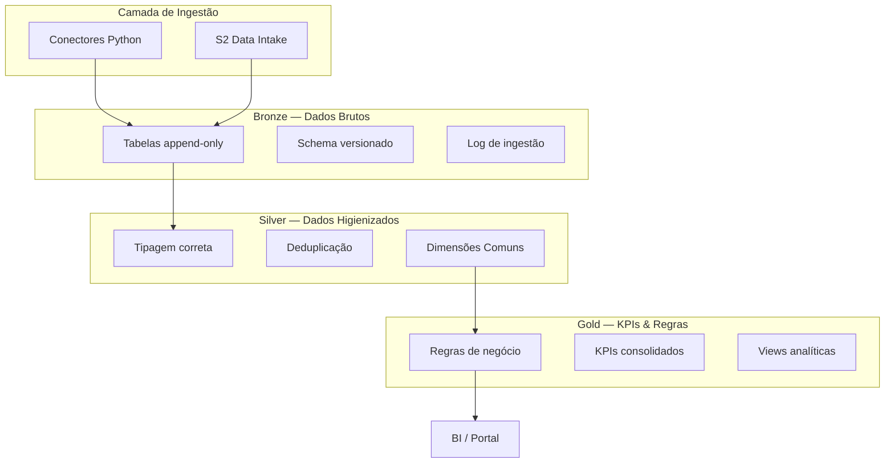

# Arquitetura — AlupData DataLake

## Visão Geral

O AlupData DataLake é um repositório centralizado de dados operacionais e de mercado do Grupo Alupar, estruturado na arquitetura **Medallion** (Bronze → Silver → Gold) sobre a **Google Cloud Platform (GCP)**.

## Arquitetura Medallion

## Dimensões Comuns Silver

**Fechadas contra fontes reais em 2026-09-14** (item 0.11 do plano), com as
regras de negócio que a Alup respondeu no bloco D do
[Questionário de Gaps](../questionario-gaps.md).

Toda view Silver declara as seis colunas, mesmo quando não as preenche —
`CAST(NULL AS STRING)` explícito. Coluna ausente quebraria consulta que cruza
fontes; coluna nula diz "esta fonte não responde por essa dimensão".

| Dimensão | Fonte da verdade | Regra | Situação |
|---|---|---|---|
| `data_referencia` | cada fonte | Data do fato, não da ingestão. Fonte sem data própria usa a data que a origem declara para o retrato (`aneel_siga`, `ccee_perfil`) | **fechada** |
| `submercado` | `ons_carga` | Sigla `N`, `NE`, `S`, `SE`. A CCEE publica por extenso e o conector converte, para as duas fontes cruzarem sem tradução na Silver | **fechada** |
| `agente_ccee` | `ccee_perfil` | Sigla do agente. Agente e perfil são distintos: um agente tem vários perfis, e é o **perfil** que transaciona | **fechada** desde 14/09 |
| `codigo_usina` | `aneel_siga` (CodCEG) | — | **em aberto — ver §Lacuna 1** |
| `periodo_apuracao` | derivada | `AAAA-MM` do calendário civil, em **todas** as views | **fechada desde 14/09** |
| `periodo_apuracao_ccee` | a origem | `AAAA-MM` que a origem declara; nulo onde ela não declara. Hoje só o `ccee_pld` o preenche, pelo `MES_REFERENCIA` | **fechada desde 14/09 — ver §Lacuna 2** |

### Regras de negócio que valem na Gold

Respondidas em 11/09 e aplicadas conforme a [ADR 012](decisoes/012-dataform.md):

| # | Regra | Origem |
|---|---|---|
| D3 | Ativo **não muda de coligada**; não há histórico de titularidade a manter | bloco D |
| D5 | Recontabilização da CCEE se **versiona**, não se sobrescreve | bloco D · [ADR 016](decisoes/016-versionamento-de-recontabilizacao.md) |
| D6 | Energia em **MWh e MWmed**; valores em **R$**, milhares ou milhões. **Sem conversão para US$** — a resposta não a cita | bloco D |
| D7 | Valor financeiro em **R$/MWh com duas casas decimais** | bloco D |
| A7 | Granularidade: **usina** para dado de portfólio; usina, estado ou submercado para dado do SIN | bloco A |

### Lacuna 1 — `codigo_usina` não tem de-para

O item **D1** informa que a Alup identifica ativos por **sigla interna** (FGE,
FOZ, IJU, QLZ, LVR, VD8, EAP I e II, PTB, EDV I a IV e X, ALP, ALUP) e que **o
CEG não é usado hoje**. CCEE e ONS usam nomes próprios para os mesmos conjuntos.

Hoje `codigo_usina` é preenchido só pelo `aneel_siga`, com CodCEG. Sem uma
tabela de correspondência **sigla ↔ CEG ↔ nome CCEE ↔ nome ONS**, o portfólio
não cruza com posição comercial nem com contabilização.

**Depende da Alup**: fornecer o de-para, ou a lista de siglas com o CEG
correspondente.

### Lacuna 2 — os dois calendários passaram a ser duas colunas

**Encerrada em 14/09**, e por um caminho diferente do previsto.

O item **D4** diz que valem **os dois calendários**: mês civil e mês CCEE. O
registro anterior desta lacuna dizia que toda Silver derivava `periodo_apuracao`
com `FORMAT_DATE`, e que definir a regra do mês CCEE era trabalho da ness.

**As duas afirmações estavam erradas.** O `ccee_pld` nunca derivou nada: ele
trazia o `MES_REFERENCIA` que a própria CCEE declara, sob o mesmo nome de coluna
que em toda outra view guarda um valor derivado. Mesma coluna, duas
proveniências, sem sinal nenhum — que é pior do que a lacuna descrita.

E a regra do mês CCEE não é da ness. para definir: seria inventar calendário do
cliente, que é exatamente o que a [ADR 012](decisoes/012-dataform.md) proíbe.

**O que foi feito.** `periodo_apuracao` passou a ser derivado da data em
**todas** as views, `ccee_pld` incluído. O período que a origem declara virou
uma sexta dimensão comum, `periodo_apuracao_ccee`, nula onde a origem não
declara nada — o mesmo tratamento que `submercado` e `codigo_usina` já recebem.

**A parte que importa é a asserção.** No `ccee_pld`, a Silver exige
`periodo_apuracao = periodo_apuracao_ccee`. Ela não é redundante: como
`data_referencia` nasce do próprio `MES_REFERENCIA` somado ao
`PERIODO_COMERCIALIZACAO`, a igualdade só quebra quando o período estoura as
horas do mês e empurra a data para o mês seguinte — o off-by-one e o retorno do
horário de verão que o dicionário do PLD nomeia como os dois riscos da fonte.

Não sabemos se o mês CCEE diverge do civil, e não vamos supor. **O dia em que
divergir, a asserção falha e o calendário se aprende do dado real**, com o dono
do domínio na mesa. Até lá, as duas colunas convivem e ninguém soma calendários
diferentes sem perceber.

## 8 Domínios Analíticos

Os domínios da **resposta da Alup ao item B1**, em 11/09. Detalhe por domínio —
pergunta, fontes, granularidade e Gold — em
**[`dominios-analiticos.md`](dominios-analiticos.md)** (item 0.10 do plano).

| # | Domínio | Data owner | Situação |
|---|---|---|---|
| 1 | Mercado de Energia | Taina Mota · Gabriel Barreto (BBCE e prêmio) | pronto do lado da CCEE — faltam EAR e ENA (ONS) |
| 2 | Geração e Operacional | Taina Mota · Letícia Ferreira | parcial — usina entregue, `codigo_usina` depende do de-para (#141) |
| 3 | Meteorologia | Taina Mota | pronto como arquivo |
| 4 | Comercial e Contratos | Letícia Ferreira · Tahigo Santos | parcial pela via pública — book interno em A7 |
| 5 | CRM e Marketing | Tahigo Santos | parcial — token do Hubspot |
| 6 | Risco e Compliance | Letícia Ferreira | iniciado — saiu de zero sem credencial |
| 7 | Econômico | Letícia Ferreira | parcial — faltam Selic e CDI |
| 8 | Planejamento | gestores da Comercialização | não iniciado |

> **Por que o quadro do B1 tem 11 linhas**: três domínios — Mercado de Energia,
> Geração e Operacional, Comercial e Contratos — aparecem em duas linhas cada,
> porque responsáveis distintos tratam subtemas deles. São 8 domínios, não 11.
>
> **O item A1 não define domínio.** Ele perguntou o que o lake precisa responder
> **como um todo**, e a Alup respondeu com objetivos do programa ("base única",
> "escalar o negócio"). É outra pergunta, e a resposta dela ordena a entrega
> (via A2), não o vocabulário da Gold.

## Stack Tecnológico

| Componente | Tecnologia |
|-----------|------------|
| Linguagem | Python 3.12+ |
| Package Manager | uv |
| Data Warehouse | BigQuery |
| Storage | Cloud Storage |
| Orquestração | Cloud Workflows (ADR 017) |
| Agendamento | Cloud Scheduler |
| Secrets | Secret Manager |
| IaC | Terraform >= 1.5 |
| CI/CD | GitHub Actions |
| Linter | Ruff |
| Testes | pytest |
| SAST | Bandit |
| SCA | pip-audit |
