# Fluxo de execução — dependências entre as tarefas

Emitido em **2026-08-28**. Liga as issues do GitHub ao plano por onda
([`plano-execucao.md`](plano-execucao.md)) e ao cronograma
([`plano-semanal.md`](plano-semanal.md)). Situação atual em
[`status.md`](status.md).

Este documento responde uma pergunta que as três outras fontes não respondem
sozinhas: **em que ordem, e o que trava o quê.** As setas são "precisa vir
antes de". Os nós tracejados são insumo da Alup (pendências A1–A9); os demais
são trabalho da ness.

---

## O grafo

```mermaid
flowchart TD
  classDef alup stroke-dasharray:5 5,stroke-width:2px
  classDef marco stroke-width:3px

  A1[/"A1 · WIF do deploy"/]:::alup
  A3[/"A3 · Projeto GCP dev · #1 #55"/]:::alup
  A4[/"A4 · Questionário de Gaps · #8"/]:::alup
  A5[/"A5 · RACI e data owners · #9"/]:::alup
  A6[/"A6 · Ferramenta de BI · #10"/]:::alup
  A2[/"A2 · Decisão CCEE · #52"/]:::alup
  A7[/"A7 · Tokens + VPN · #11 #12 #13 #14 #15"/]:::alup
  A8[/"A8 · Docs BBCE / TempoOK"/]:::alup
  A9[/"A9 · Token Hubspot · #11"/]:::alup
  A16[/"A · Padronizar planilhas · #16"/]:::alup

  APPLY{{"1º terraform apply + deploy real"}}:::marco

  subgraph O0["Onda 0 · Fundação — marco 15,52%"]
    i58["#58 · FinOps F0 (rótulos, antes do apply)"]
    i5["#5 · 8 domínios analíticos"]
    i4["#4 · Dimensões comuns Silver"]
    i6["#6 · Portal MVP autenticado"]
  end
  subgraph O1["Onda 1 · Mercado — marco 20,69%"]
    i17["#17 · CCEE InfoMercado"]
  end
  subgraph O2["Onda 2 · APIs credenciadas"]
    i24["#24 · Hubspot"]
    i23["#23 · BBCE"]
    i25["#25 · TempoOK"]
    i22["#22 · CCEE credenciado"]
  end
  subgraph O3["Onda 3 · Sistemas internos"]
    i27["#27 · Oracle FMB"]
    i29["#29 · Portal Alup"]
    i31["#31 · MySQL RDS"]
    i32["#32 · RM/TOTVS"]
  end
  subgraph O4["Onda 4 · Governança e handoff"]
    i34["#34 · S2 Data Intake"]
    i38["#38 · Views Gold — KPIs"]
    i36["#36 · Dataplex"]
    i40["#40 · Handoff + docs finais"]
  end

  A1 --> APPLY
  A3 --> APPLY
  i58 --> APPLY

  A4 --> i5 --> i4
  i5 --> i38
  A5 --> i6
  A6 --> i6
  APPLY --> i6
  APPLY --> i4
  APPLY --> i17
  APPLY --> i22
  APPLY --> i23
  APPLY --> i24
  APPLY --> i25
  APPLY --> i27
  APPLY --> i29
  APPLY --> i31
  APPLY --> i32

  A2 --> i17
  A9 --> i24
  A7 --> i22
  A7 --> i23
  A7 --> i25
  A7 --> i27
  A7 --> i29
  A7 --> i31
  A7 --> i32
  A8 --> i23
  A8 --> i25
  A16 --> i34

  i38 --> i40
  i36 --> i40
  i34 --> i40
```

---

## O caminho crítico

Uma linha só, e é onde todo o cronograma se apoia:

**A3 (projeto GCP) → 1º apply → Onda 0 homologada → Onda 1 homologada.**

- **A3 é o gargalo mestre.** Quase todo trabalho técnico que ainda não foi feito
  espera o `terraform apply`, e o apply espera A3 (`#1`/`#55`) e A1 (WIF). Nada
  da ness. destrava isso — é decisão da Alup.
- **Onda 0 não fecha só com o apply.** Precisa também de A4 → `#5` (8 domínios)
  → `#4` (dimensões), e de A5/A6 para o Portal (`#6`) ter dono e consumidor.
- **`#58` F0 é o único item com prazo biológico.** Rótulo de custo tem de entrar
  *no* apply, não depois — custo já gasto não se rateia retroativamente. Por isso
  a seta é `#58 → apply`, e não o contrário.
- **Ondas 2 e 3 são um leque atrás de A7/A8.** Cada conector interno tem sua
  própria porta de credencial: `#12→#27`, `#13→#29`, `#14→#31`, `#15→#32`. Abrir
  esses pedidos cedo (A7) é o maior risco financeiro do contrato — atraso dispara
  ociosidade de 4h/dia.

---

## Issue → onda → o que a trava → o que ela destrava

| Issue | Onda | Bloqueada por | Destrava |
|---|---|---|---|
| `#1`/`#55` · Projeto GCP (A3) | 0 | **Alup** | o 1º apply e, por ele, quase tudo |
| `#8` · Questionário de Gaps (A4) | 0 | **Alup** | `#5` |
| `#9` · RACI (A5) | 0 | **Alup** | `#6` |
| `#10` · Ferramenta de BI (A6) | 0 | **Alup** | `#6`, consumidores da Gold |
| `#58` · FinOps F0 (rótulos) | 0 | — (fazer já) | atribuição de custo por fonte |
| `#5` · 8 domínios analíticos | 0 | `#8` | `#4`, `#38` |
| `#4` · Dimensões comuns Silver | 0 | 1º apply, `#5` | Gold com dado real |
| `#6` · Portal MVP autenticado | 0 | 1º apply, A5, A6 | evidência da Onda 0 |
| `#52` · CCEE 403 (A2) | 1 | **Alup** | `#17` |
| `#17` · CCEE InfoMercado | 1 | 1º apply, `#52` | fecha a Onda 1 |
| `#11` · Tokens (A7/A9) | 2 | **Alup** | `#22 #23 #24 #25` |
| `#24` · Hubspot | 2 | 1º apply, `#11` (A9) | conector já pronto — rodar e conferir |
| `#23` · BBCE | 2 | 1º apply, `#11`, A8 | — |
| `#25` · TempoOK | 2 | 1º apply, `#11`, A8 | — |
| `#22` · CCEE credenciado | 2 | 1º apply, `#11` | — |
| `#12` · VPN Oracle (A7) | 3 | **Alup** | `#27` |
| `#13` · Creds Portal Alup (A7) | 3 | **Alup** | `#29` |
| `#14` · Conn MySQL RDS (A7) | 3 | **Alup** | `#31` |
| `#15` · Endpoints RM/TOTVS (A7) | 3 | **Alup** | `#32` |
| `#27 #29 #31 #32` · Conectores internos | 3 | 1º apply + credencial própria | fecha a Onda 3 |
| `#16` · Padronizar planilhas | 4 | **Alup** | `#34` |
| `#34` · S2 Data Intake | 4 | `#16` | `#40` |
| `#38` · Views Gold — KPIs | 4 | `#5` | `#40` |
| `#36` · Dataplex | 4 | 1º apply | `#40` |
| `#40` · Handoff + docs finais | 4 | `#34 #36 #38` | encerra a Fase 1 |

> `#57` (relatório de situação 27/08 — as 11 questões) e `#55` são issues de
> acompanhamento/insumo, não tarefas de execução; entram no grafo pela pendência
> que carregam (A3), não como nó próprio.

---

## Pendências da Alup → o que cada uma libera → prazo

Prazos vindos do [`plano-semanal.md`](plano-semanal.md); o efeito de atraso é o
da cláusula 3ª.

| Pendência | Libera | Prazo útil | Se não vier |
|---|---|---|---|
| **A3** · projeto GCP (`#1`/`#55`) | o 1º apply e quase tudo | 04/09 | Onda 0 não homologa; S2/S3 escorregam |
| **A1** · WIF do deploy | autenticação do workflow de deploy | 04/09 | o apply não sobe |
| **A9** · token Hubspot (`#11`) | `#24` | 11/09 | conector pronto fica parado |
| **A4** · Questionário de Gaps (`#8`) | `#5` → `#4`, `#38` | 11/09 | Gold da Onda 1 sem alvo |
| **A5/A6** · RACI e BI (`#9`/`#10`) | `#6` e consumidores da Gold | 11/09 | Portal sem dono/consumidor |
| **A2** · decisão CCEE (`#52`) | `#17` | 18/09 | 32h da Onda 1 paradas |
| **A7** · tokens e VPN (`#11`–`#15`) | Ondas 2 e 3 inteiras | 25/09 | ociosidade de 4h/dia (R$ 256/h) |
| **A8** · docs BBCE/TempoOK | escrever `#23`/`#25` antes do token | 25/09 | Onda 2 só começa depois do token |

---

## Como manter isto vivo

O grafo é o mapa; o GitHub é a fonte da verdade. Quando as issues forem ligadas
lá (epics por onda + sub-issues, e "bloqueada por" onde a API permitir), este
documento vira a leitura humana do mesmo grafo — e a atualização é: fechou uma
pendência da Alup, risque a linha dela na tabela e feche as issues que ela
destravava.
